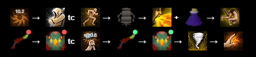
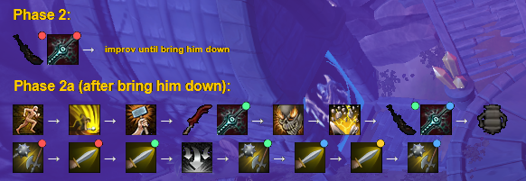
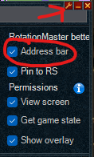
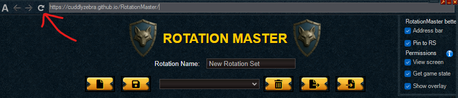

# RotationMaster (fork)

This is a fork of [RotationMaster](https://github.com/Ellamental2/RotationMaster) by Ellamental2 — an Alt1 toolkit app for building and overlaying boss/combat ability rotation "cheat sheets" in RuneScape 3.

## Changes in this fork

- **Manual rotation restart** — triple-tap the Alt1 hotkey (or use the "Restart Rotation" button) to jump back to the first rotation at any time. A single press still cycles rotations as before; either action now gets a brief grace period before automatic phase detection can override it, so a manual change actually sticks instead of being immediately reverted.

- **Reduced phase/wave detection overhead** — the full-screen capture + template match + OCR read used for phase/wave tracking now runs every 500ms instead of every 250ms. This fixed a significant FPS drop (100+ down to ~60, with visible stutter) during fights, at the cost of phase changes being detected up to half a second later — imperceptible in practice given how long phases typically last.

- **Duplicate ability colour-coding** — when an ability appears more than once in a rotation, each occurrence gets its own small coloured dot in the corner of its icon. Every instance of that same ability shares its colour (e.g. every "Varanus's Mercy" is the same shade), while a different repeated ability gets a different colour. This makes it easier to keep your place in a long rotation without your eyes accidentally jumping to a different occurrence of the same ability further down the sequence.

- **Phase detection rework** — phase/wave transitions are now tracked using coloured status circles plus direct on-screen phase reading. This gives more reliable phase advancement during fights where the old approach could misfire.

- **HP-zero-based phase auto-advance** — for bosses with no on-screen phase/wave banner (Vorago being the motivating case), the app can instead watch the boss's HP% for the moment it template-matches a "0" and auto-advance to the next rotation from there, the same idea used by [VoragoTag](https://github.com/cuddlyzebra/VoragoTag). Off by default — turn on **"Auto-advance on Boss HP 0% (no phase banner)"** in Settings for fights that need it, and leave it off for anything already handled by normal Phase/Wave detection.

- **Section headings and custom spacing inside a rotation preview** — a rotation can now be broken into labelled sections without needing separate selectable rotations for each one, all from the rotation designer itself (no JSON editing required):
  - Every ability row's Notes box now has a **"Heading"** checkbox next to it. Tick it and the text you type renders as a bold, coloured heading instead of a small caption — handy for showing two time-gated halves of one phase (say, "Phase 2" and "Phase 2a") in a single overlay, one under the other. (Under the hood this just prefixes the Notes value with `## `, so a heading saved from an older hand-edited JSON is picked up and shown ticked automatically.)
  - Every row also has a **"Row break"** checkbox, which starts a new row in the preview at that ability. Once ticked, a small number field appears next to it (1–5) for extra vertical gap before that specific row, independent of the global "Line Break Spacing" setting — useful for putting a bit more air above a new heading than between ordinary rows. (This is the `↵`/`↵↵` separator from before, now exposed as a checkbox + number instead of needing to be typed in.)
  - Heading appearance is customizable from Settings: **"Heading Text Size"** (a slider, 10–40px) and **"Heading Text Color"** (a colour picker) apply to every heading in the overlay by default. Each heading row can also override either of these individually from the designer: a number field appears next to a ticked Heading checkbox for a size override (leave blank to keep using the global setting), and a **"Custom colour"** checkbox below it reveals a colour swatch for a colour override on just that heading — handy for giving something like a "Phase 2" heading and its "Phase 2a" sub-heading visibly different colours or sizes from one another.
  - When an ability icon is paired with a heading, the icon is now centered relative to the heading text rather than sitting flush against the left edge — this matters once a heading is wider than the icon (or vice versa).

- **Per-phase overlay position** — each phase/rotation can now have its own on-screen position instead of always sharing the one global "Overlay Position". Next to a rotation's Name/Wave fields, a crosshair button starts the same Alt+1 drag-to-position flow as the global "Set Overlay Position" button in Settings, but saves the result onto that phase only; a second button appears once a phase has a custom position, to drop it back to using the default. Useful when a bigger phase (say, one with a lot more abilities/headings) would otherwise cover up something on screen that a smaller phase doesn't.

- **Configurable delay before HP-zero phase auto-advance** — when "Auto-advance on Boss HP 0% (no phase banner)" is on, a new **"Phase Advance Delay (after Boss HP 0%)"** slider (0–30s, default 12s) controls how long the current phase's overlay stays up after HP hits 0% before switching to the next one. Useful for fights (e.g. Vorago) where players are still using the current phase's callouts for several seconds after HP drops, before the next phase's mechanics actually start.

### Example



Section headings (`## Phase 2` / `## Phase 2a`) with a widened gap before the second one, and a heading colour/size set from Settings:



### How to install

Copy and paste this line into your web browser's address bar `alt1://addapp/https://cuddlyzebra.github.io/RotationMaster/appconfig.json` - optionally, you can edit the title yourself when prompted to install, to help distinguish this version over the original version of the app.

### Refreshing the app if a feature seems missing

This app is hosted on GitHub Pages and loaded inside Alt1's own embedded browser, which sometimes keeps showing a cached, older copy of the page even after the site itself has updated — a setting you'd expect to see might just not be there yet, or something might look visually broken. If that happens, force a fresh reload rather than assuming something's wrong:

1. Open the app's settings (wrench icon) and enable the address bar option, if it isn't already on.

   

2. With the address bar visible, click its refresh button to force the page to reload from scratch, bypassing the cached copy.

   

This should only be needed right after the app itself has been updated — if things still look wrong after a refresh, it's worth reporting rather than assuming it's a caching issue.

## Credit

All core functionality (rotation building, the Alt1 overlay, wave/phase detection, settings) is from the original [RotationMaster](https://github.com/Ellamental2/RotationMaster) project. This fork only adds the changes described above.

## Deploying this fork (for maintainers)

GitHub Pages for this repo serves the `docs/` folder on `master`. There is no automatic build step — after any source change, the site must be rebuilt and redeployed manually:

```
npx ng build --base-href /RotationMaster/
```

Then copy the fresh build output into `docs/`, replacing the old hashed files but leaving `appconfig.json`, `detect-libc.js`, and `sharp.js` untouched (these aren't build output — they're stub files referenced by an import map in `index.html` that redirect Node-only modules to browser-safe versions):

```
Remove-Item docs\main-*.js, docs\polyfills-*.js, docs\styles-*.css
Copy-Item dist\RotationMaster\browser\* docs\ -Recurse -Force
```

Then commit and push `docs/` to `master` as usual. Note that GitHub Pages' CDN can take a few minutes to pick up a fresh `index.html` after a deploy — if the live site looks unchanged right after pushing, wait a few minutes or append a cache-busting query string (e.g. `?v=2`) before assuming something's broken.
